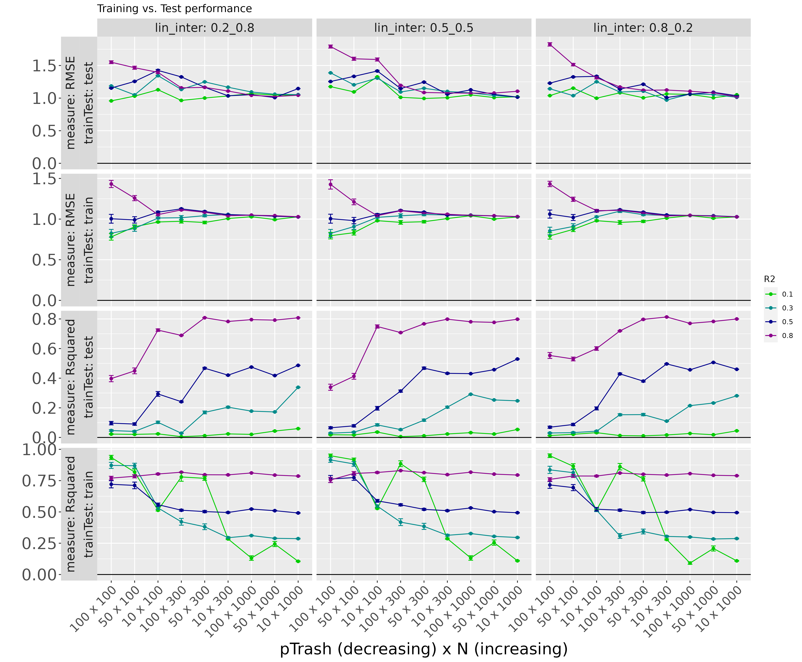
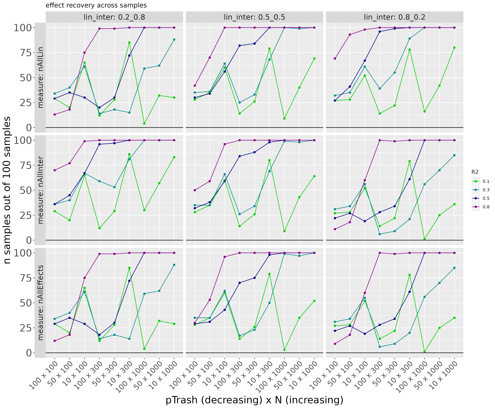
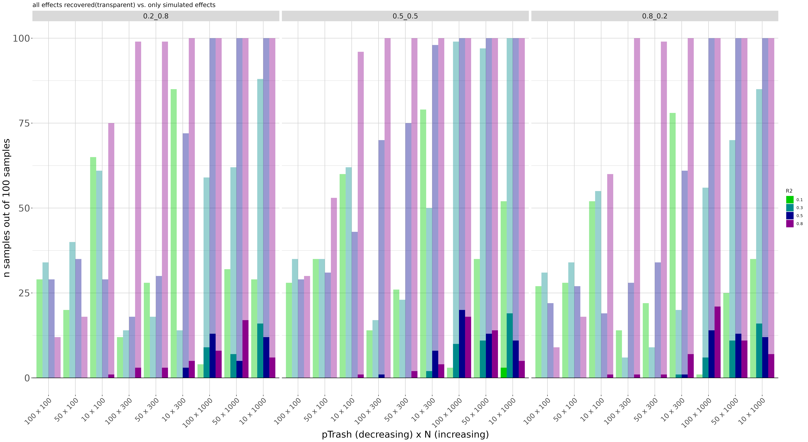
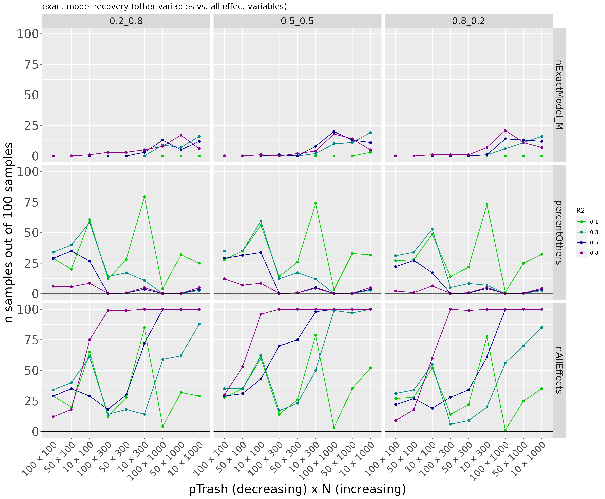
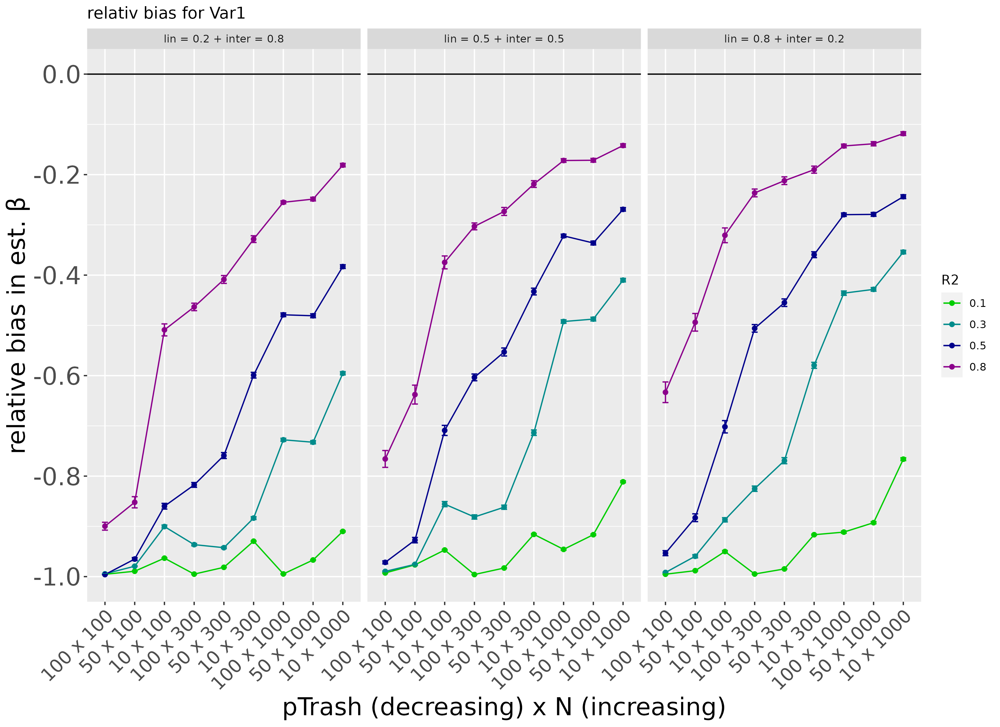
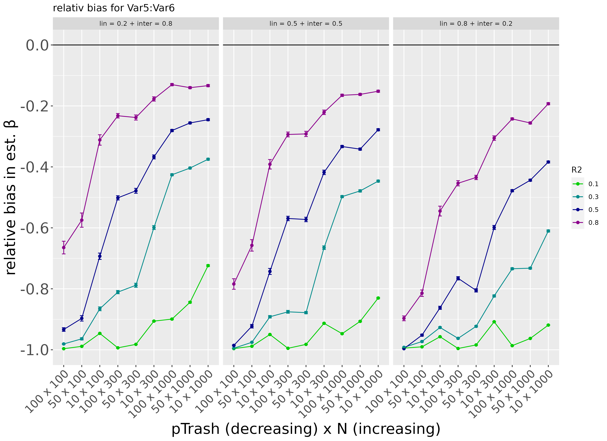

Initial results for elastic net (via glmnet) in the following (preliminary) conditions

- number of observations: N = {100, 300, 1000}  
- number of trash variables: pTrash = {10, 50, 100}
- $R^2$: R2 = {0.1, 0.3, 0.5, 0.8}
- effect dsitribution to linear vs. interaction effects: lin_inter = {0.2_0.8, 0.5_0.5, 0.8_0.2}

Parameters can be found in [setParameters.R](https://github.com/kimSpeck/MLsim/blob/main/setParameters.R)

Kim: Vielleicht können wir erste Beobachtungen, Überlegungen oder Fragen, die sich bei uns ergeben hier schon sammeln?

FS:
Wie sinnvoll ist der Bias als Kriterium hier?
Ist das einfach der mittlere Bias über alle Modelle hinweg, auch über die, wo der Parameter null ist?
p-Trash als Manipulation diskutieren

# results
## Training and Test Performance 

Check general performance of the elastic net in different simulated conditions.
Training performance is averaged across all 100 training samples. 
Test performance for one sample with 50% of number of observations (N) in current condition. 

## recovery variables with simulated effects

In wie vielen der 100 Training Samples werden alle Effekte, lineare Effekte und Interaktionseffekte recovert?

Wie häufig werden alle simulierten Effekte (lineare & Interaktionseffekte, transparent) vs. das wahre Modell (keine anderen Prädiktoren!) recovert?

Erklärung der seltenen Recovery des wahren Modells durch ...

- Extraktion zusätzlicher Prädiktoren
- keine vollständige Extraktion der simulierten Prädiktoren

## estimated coefficients

relativer Bias in geschätzten Koeffizienten über alle Samples hinweg

### linearer Effekt

ein exemplarischer Prädiktor mit einem simulierten linearen Effekt

### Interaktionseffekt
ein exemplarischer Prädiktor mit einem simulierten Interaktionseffekt

